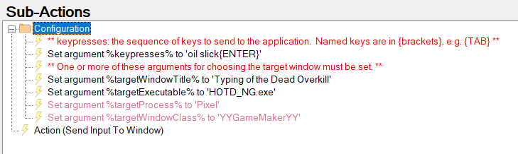

# Send Input to Window Extension for Streamer.bot

This extension for [Streamer.bot](https://streamer.bot) is an action which lets you send keystrokes to an application window.  It differs from the built-in [Keyboard Press subaction](https://docs.streamer.bot/api/sub-actions/core/system/keyboard-press) by targeting a specific window, rather than whichever window currently has the system focus or is on top.

## Installation

1. Import [SendInputToWindow.sb](https://raw.githubusercontent.com/WhazzItToYa/Streamerbot-SendInputToWindow/refs/heads/main/SendInputToWindow.sb) into Streamer.bot

## Usage

To identify which window to send the input to, one or more of the following arguments must be set:
* `targetWindowTitle`: The title of the window to send the keystrokes to. Can be a partial match.
* `targetWindowClass`: The window class. If supplied, it must match exactly.
* `targetProcess`: The name of the window's process. Can be a partial match.
* `targetExecutable`: Either the executable's filename (e.g. `notepad.exe`), or the full path and filename (`c:\windows\system32\notepad.exe`), but it must match exactly.

To tell the action what keystrokes to send, set the argument:
* `keypresses` (required): The sequence of keypresses to send to the target window. See [Keypress codes](#Keypress%20Codes)
  * example: `hello world{enter}`

To set delays:
* `keypressDelay` : the number of milliseconds to wait between keypresses. Optional, defaulting to 0 (no delay).
* `keypressHold` : the number of milliseconds to hold each key down. Optional, defaulting to 0 (no delay).

After those arguments are set, use the [Run Action subaction](https://docs.streamer.bot/api/sub-actions/core/actions/run-action) to run the action `Send Input To Window`.

### Example
The extension contains an example action that sends the word "oil slick" followed by the Enter key, to the game "Typing of the Dead Overkill", run by the NOTD_NG.exe program.

### Delay and Hold down Example

A `keypresses` of "`{UP:1000}{:500}{LEFT:50}{DOWN:2000}`" will hold the up arrrow for 1 second, pause for 1/2 second, hold the down arrow for 50 milliseconds, and then down for 2 seconds.

## Keypress Codes

Each element of the `keypresses` argument can be one of:
* A single character : will type that character's key (down and up).
* `{KEYNAME}` : will type one of the named keys listed below. KEYNAME may also be one of the single characters, e.g. `{A}`
* `{KEYNAME:DELAY}` : will type one of the named keys listed below, holding it down for DELAY milliseconds.
* `{:DELAY}` : inserts a pause for DELAY milliseconds.

### Single Characters
The following single-character keys are recognized:
* " " (space)
* 0-9, A-Z
* \; \: \+ \= \, \< \- \_ \. \> \/ \? \~ \` \[ \\ \| \] \' \"
Note that some characters are just the shifted versions of a key's base character ("=" and "+").  They are included for convenience, but they send the same keycode to the app as the unshifted character.

### Key Names
The named keys, which you must put inside `{...}` are:
* LBUTTON:  Left mouse button
* RBUTTON:  Right mouse button
* MBUTTON:  Middle mouse button
* XBUTTON1:  X1 mouse button
* XBUTTON2:  X2 mouse button
* BACK:  Backspace key
* TAB:  Tab key
* RETURN:  Enter key
* ENTER:  Enter key
* SHIFT:  Generic Shift key
* LSHIFT: Left Shift key
* RSHIFT: Right Shift key
* CONTROL or CTRL: Generic Ctrl key
* LCONTROL or LCTRL: Left Ctrl key
* RCONTROL or RCTRL: Right Ctrl key
* LMENU
* RMENU
* ALT:  Alt key
* PAUSE:  Pause key
* CAPSLOCK:  Caps Lock key
* ESCAPE:  Escape key
* SPACE:  Spacebar
* PAGEUP:  Page Up key
* PAGEDOWN:  Page Down key
* END:  End key
* HOME:  Home key
* LEFT:  Left arrow key
* UP:  Up arrow key
* RIGHT:  Right arrow key
* DOWN:  Down arrow key
* SELECT:  Select key
* PRINT:  Print key
* EXECUTE:  Execute key
* PRINTSCREEN:  Print Screen key
* INSERT:  Insert key
* DELETE:  Delete key
* HELP:  Help key
* F1 - F24
* NUMLOCK
* SCROLLLOCK
* NUMPAD0 - NUMPAD9
* MULTIPLY
* ADD
* SEPARATOR
* SUBTRACT
* DECIMAL
* DIVIDE
* BROWSER\_BACK
* BROWSER\_FORWARD
* BROWSER\_REFRESH
* BROWSER\_STOP
* BROWSER\_SEARCH
* BROWSER\_FAVORITES
* BROWSER\_HOME
* VOLUME\_MUTE
* VOLUME\_DOWN
* VOLUME\_UP
* MEDIA\_NEXT\_TRACK
* MEDIA\_PREV\_TRACK
* MEDIA\_STOP
* MEDIA\_PLAY\_PAUSE
* LAUNCH\_MAIL
* LAUNCH\_MEDIA\_SELECT
* LAUNCH\_APP1
* LAUNCH\_APP2

## Notes, Troubleshooting

### Doesn't Work With All Apps

Some apps are not compatible with the generic technique that this extension uses to send input (SendMessage).

### Anitcheat

Games with Anitcheat may block this from working on them, or even flag it as cheating behavior.  You've been warned.

### Using `target*` Arguments.

Try to choose the longest portion of the window title that is guaranteed to be in the title at all times, and doesn't appear in any other windows.

If that still doesn't uniquely identify the correct window, you may need to add the process name or executable, or the window's "class" to narrow it down further.

### Figuring out Window Info

A window's "class" is a hidden property of the window, and the title might not be visible if it is a fullscreen or borderless window. So how do you figure them out?

When you Alt-Tab, the window's title is displayed on the thumbnails.

For more window information, there are utilities like [AutoHotKey](https://www.autohotkey.com/)'s Window Spy that will show you the title, class, process and executable of a window.  Other utilites include Spy++, Window Inspector, or WinSpy++.

## Contact

* For feature requests or bug reports: https://github.com/WhazzItToYa/Streamerbot-SendInputToWindow/issues 
* Or submit a pull request
* Or if you can't do either of those things, ping me through the Streamer.bot Discord in the [Send Keyboard Presses to Window post](https://discord.com/channels/834650675224248362/1351424830469050440)

